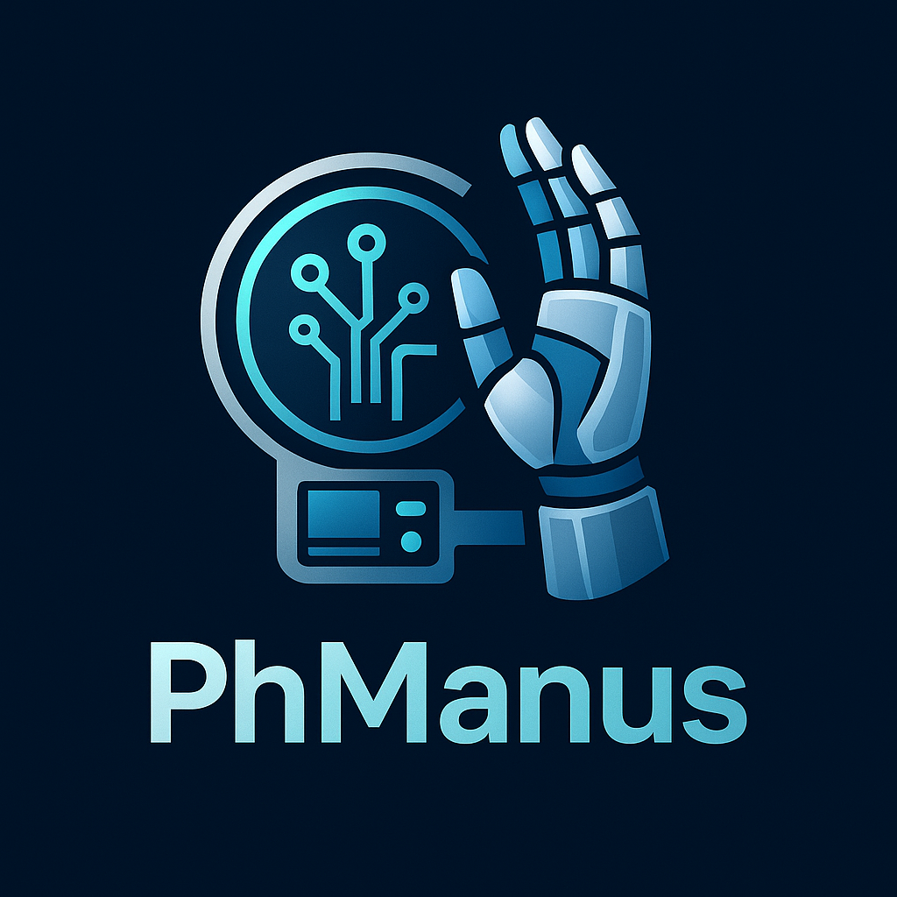

# PhManus

<p align="center">
  
</p>

**PhManus** is a task planning and execution framework that leverages agents to create, manage, and execute plans. It is designed to handle both simple and complex tasks using a modular and extensible architecture.

---

## Features

- **Dynamic Task Planning**: Automatically generates actionable plans for tasks using an LLM (Language Learning Model) and a planning tool.
- **Agent-Based Execution**: Executes tasks using specialized agents, with support for multiple agents and step-specific execution.
- **Simple Task Handling**: Detects and handles simple tasks directly without detailed planning.
- **Plan Management**: Tracks task progress, step statuses, and provides summaries upon completion.
- **Extensibility**: Easily extendable to support new agents, tools, and workflows.

---

## Installation

1. Clone the repository:
   ```bash
   git clone https://github.com/farmountain/PhManus.git
   cd PhManus
   ```

2. Install dependencies:
   ```bash
   pip install -r requirements.txt
   ```

3. Set up any required environment variables (e.g., API keys for LLM or tools).

---

## Usage

### 1. Initialize the Planning Flow
The `PlanningFlow` class is the core of the framework. It manages agents, plans, and task execution.

```python
from app.flow.planning import PlanningFlow
from app.agent.base import BaseAgent

# Example: Initialize with agents
agents = {
    "primary": BaseAgent(name="PrimaryAgent"),
    "search": BaseAgent(name="SearchAgent"),
}
flow = PlanningFlow(agents=agents)
```

### 2. Execute a Task
Use the `execute` method to run a task through the planning flow.

```python
import asyncio

async def run_task():
    result = await flow.execute("Find the stock price of Tesla")
    print(result)

asyncio.run(run_task())
```

### 3. Extend Functionality
You can extend the framework by:
- Adding new agents by subclassing `BaseAgent`.
- Implementing custom tools for specific tasks.
- Modifying the planning logic in `PlanningFlow`.

---

## Key Components

### 1. **Agents**
Agents are responsible for executing specific steps in a plan. The `get_executor` method selects the appropriate agent based on the step type.

### 2. **Planning Tool**
The `PlanningTool` manages plans, including creating, updating, and retrieving plan details.

### 3. **LLM Integration**
The framework integrates with an LLM to generate plans and summaries.

---

## Example Workflow

1. **Input a Task**: Provide a task description to the `execute` method.
2. **Plan Creation**: The framework generates a plan using the LLM and planning tool.
3. **Step Execution**: Each step is executed by the appropriate agent.
4. **Completion**: The framework finalizes the plan and provides a summary.

---

## Contributing

Contributions are welcome! To contribute:
1. Fork the repository.
2. Create a new branch for your feature or bug fix.
3. Submit a pull request with a detailed description of your changes.

---

## License

This project is licensed under the [MIT License](LICENSE).

---

## Contact

For questions or support, please contact:

- farmountain@gmail.com
- keong-han.liew@capgemini.com
